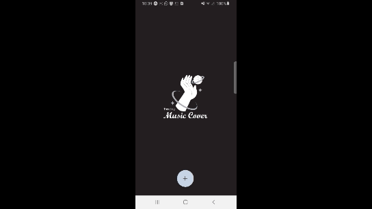

<h1 align="center">
    
</h1>

<h4 align="center"> 
	Floating Action Button
</h4>

<p align="center">
  

  	
  
  <a href="https://github.com/Oppadayo/ecoleta/commits/master">
    
  </a>

  
   <a href="https://github.com/Oppadayo/ecoleta/stargazers">
    
  </a>
</p>


## 💻 Sobre o projeto

Projeto para o youtube - Um botão flutuante animado para react native

## 🛠 Tecnologias

As seguintes ferramentas foram usadas na construção do projeto:

- Expo
- Javascript
- React Native


## 🚀 Como executar o projeto

### Pré-requisitos

Antes de começar, você vai precisar ter instalado em sua máquina as seguintes ferramentas:
[Git](https://git-scm.com), Node.js. 
Além disto é bom ter um editor para trabalhar com o código como VSCode

### 🧭 Rodando a aplicação

```bash
# Clone este repositório
$ git clone https://github.com/Oppadayo/floating-action-button

# Acesse a pasta do projeto no seu terminal/cmd
$ cd floating-action-button

# Instale as dependências
$ npm install

# Execute a aplicação em modo de desenvolvimento
$ npm start

# A aplicação será aberta na 19001 - Ela abre uma aba com as opções de rodar a aplicação no emulador ou no celular usando o QR code
```


